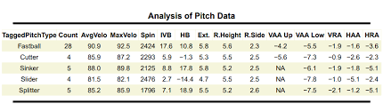
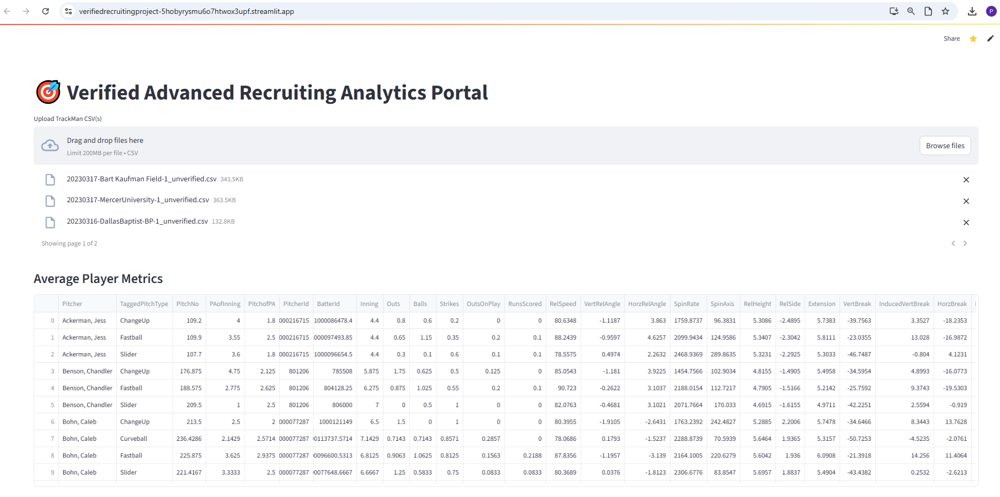
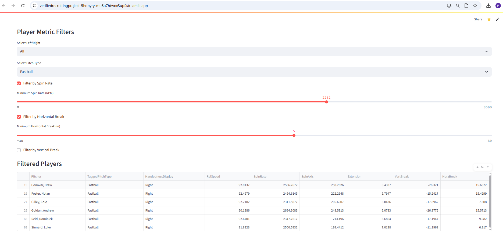

# Verified Advanced Analytics Recruiting Portal Project
## Preston Tabor - Dallas Bapist University Graduate Assistant Baseball Coach

**Verified Athletics allows college baseball programs to view all players currently in the transfer portal looking for a new home. However, it only shows traditional statistics such as ERA, hits, walks, etc. This does not always provide coaches with an accurate description of the style of player they are looking for. More advanced metrics such as spin rate, induced vbreak and hbreak, tilt, velocity, launch angle, barrel speed and many others help identify a player that will best suit the needs of the program. These metrics are most commonly collected and stored through Trackman, Rapsodo, and Hawkeye data that can be uploaded into databases like TruMedia. The goal of this project is to create a website/database that takes all players in the transfer portal, syncs the advanced metrics of theirs from these data collecting units, and allows coaches to filter their search based on said metrics. The current system available to coaches only allows for filtering based on basic attributes like left/right handed and traditional statistics. This system will provide programs with a much more advanced way of filtering through the vast landscape that is the transfer portal.**

  
  

